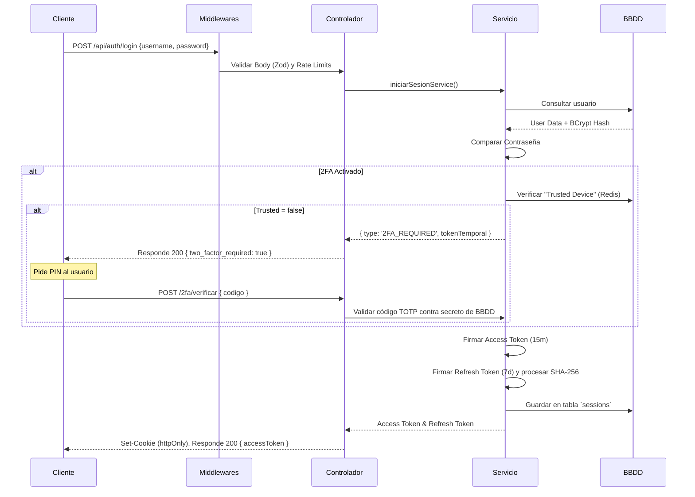

# Documentación Técnica: Flujo de Autenticación y Seguridad (IAM) - CineVault

Este documento detalla la arquitectura, flujos y componentes de seguridad implementados en el backend de CineVault, abarcando desde la gestión de tokens JWT y persistencia, hasta mecanismos avanzados como 2FA con TOTP. 

## 1. Módulo de Autenticación (`JWT` y Ciclo de Vida)

El sistema de identidades utiliza un modelo de **doble token** (Access y Refresh JWT) para proveer un balance entre experiencia de usuario (UX) y seguridad robusta.

### Flujo de Tokens
- **Access Token:** Es un JWT de vida corta (15 minutos) que contiene el `user_id`, `role` e `is_verified`. Se utiliza para autorizar cada petición a endpoints protegidos. Se almacena en el cliente a través de una cookie `HttpOnly`.
- **Refresh Token:** Es un JWT de vida larga (7 días) utilizado exclusivamente para obtener un nuevo Access Token cuando este expira. Contiene un identificador de sesión `id_session` único. Se envía mediante la cookie `refresh_token` también protegida.

**Ejemplo de creación de Access Token (`src/lib/tokens.ts`):**
```typescript
export const crearTokenAcceso = (
  idUsuario: number,
  rol: string,
  isVerified: boolean
) => {
  const payload: PayloadAcceso = {
    user_id: idUsuario,
    role: rol as PayloadAcceso["role"],
    is_verified: isVerified,
  }
  return jwt.sign(payload, process.env.JWT_SECRET!, {
    expiresIn: "15m",
  })
}
```

### Rotación y Revocación de Sesiones
> **IMPORTANTE**
> La gestión de sesiones permite el control activo. Al renovar un token (endpoint `/refresh`), el token de refresco anterior se invalida eliminando su registro de la base de datos y se expide uno nuevo ligado a una nueva ID de sesión. Esto asegura una rotación total y previene ataques de rehuso de tokens robados.

---

## 2. Persistencia y Seguridad

La plataforma separa claramente las responsabilidades, preservando los datos de forma encriptada u ofuscada. No se almacenan contraseñas en texto claro.

- **Hashes de Contraseña:** Las contraseñas pasan por un proceso de derivación (hashing) utilizando **bcrypt** con un factor de coste de **10 rondas** antes de ser persistidas (`src/lib/crypto.ts`).
- **Almacenamiento de Tokens Mágicos:** Los tokens para verificación de correos y reseteo de claves se encriptan con JWT (`VERIFY_EMAIL_SECRET`), e igual se registra la fecha de expiración en la tabla auxiliar de `auth_tokens`.
- **Protección de Identificadores (Hash de Sesiones):** El *Refresh Token* genera un registro en base de datos. Para evitar filtraciones, el token original no se consulta por simple texto; en su lugar, se consulta validando su hash `SHA-256` grabado en la columna `token_hash`.

**Ejemplo de protección por Hash del Refresh Token en BD (`src/lib/tokens.ts`):**
```typescript
/**
 * Se guarda el HASH del token en DB para mayor seguridad (Slow lookup).
 */
export const crearTokenRefresco = async (idUsuario: number) => {
  const idSesion = crypto.randomUUID()
  const token = jwt.sign(
    { id_session: idSesion, user_id: idUsuario },
    process.env.REFRESH_SECRET!,
    { expiresIn: `7d` }
  )

  await sessionRepository.create({
    id: idSesion,
    refresh_token: token, 
    token_hash: hashearToken(token), // Hashing SHA-256 antes de guardarlo c/ crypto
    users: { connect: { id: idUsuario } },
    expires_at: expiracionConfigurada,
  })

  return { token, idSesion }
}
```

---

## 3. Entidades y Tablas en Base de Datos (Prisma)

Estas son las principales tablas dentro del esquema que sustentan el ecosistema de seguridad:

| Entidad | Propósito y Función |
|---------|-----------------------|
| **`users`** | Entidad principal (fuente de la verdad). Contiene el `username`, `email`, la `password` (hasheada en bcrypt), banderas de seguridad (`is_verified`, `two_factor_enabled`), el `two_factor_secret` encriptado en AES-256-CBC, y un enlace Oauth con `google_id`. |
| **`sessions`** | Representan una sesión activa de un usuario en un dispositivo. Almacenan información de la conexión (`ip_address`, `user_agent`), la fecha de caducidad `expires_at`, y el identificador `token_hash` como capa de validación adicional. |
| **`auth_tokens`** | Gestor efímero para operaciones de un solo uso (*One-Time Actions*). Abarca enlaces de Registro (`VERIFY_EMAIL`) y recuperación de contraseña (`RESET_PASSWORD`). |

---

## 4. Diagrama de Flujo de Autenticación (Auth Flow)

A continuación, se ilustra el proceso interno de aserción y autorización manejado por el `AuthController` y `AuthServices`:



---

## 5. Implementación Plus: Multi-Factor Authentication (2FA) / TOTP

El estándar **TOTP** (Time-Based One-Time Password), comúnmente usado en aplicaciones como *Google Authenticator* o *Authy*, ofrece una capa robusta que protege la cuenta de intentos maliciosos, incluso si la contraseña ha sido comprometida. 

### Arquitectura de Integración en CineVault
1. **Configuración Inicial:** El endpoint `POST /2fa/activar` genera dinámicamente un secreto utilizando `OTPAuth.Secret`. Este secreto se **encripta simétricamente con AES-256-CBC** (`crypto.ts`) usando una clave maestra de entorno (`TWO_FACTOR_ENCRYPTION_KEY`) para que persista seguro en la columna `two_factor_secret` de MySQL, protegiéndolo completamente de ataques directos o filtraciones a nivel de base de datos.
   
```typescript
// src/lib/crypto.ts
export const encriptarSecreto = (texto: string) => {
  const iv = crypto.randomBytes(16) // IV de longitud 16 (AES standard)
  const cipher = crypto.createCipheriv("aes-256-cbc", ENCRYPTION_KEY, iv)
  const encriptado = Buffer.concat([cipher.update(texto), cipher.final()])
  return `${iv.toString("hex")}:${encriptado.toString("hex")}`
}
```

```typescript
// src/services/auth.services.ts
export const activar2FAService = async (userId: number) => {
  const totp = new OTPAuth.TOTP({
    issuer: "CineVault",
    label: userId.toString(),
    algorithm: "SHA1",
    digits: 6,
    period: 30,
    secret: new OTPAuth.Secret(),
  })

  // Extraemos el secreto en Base32
  const secreto = totp.secret.base32
  const uri = totp.toString()

  // Guardamos en la BBDD el secreto ENCRIPTADO
  await userRepository.update(userId, {
    two_factor_secret: encriptarSecreto(secreto),
  })

  const qr = await QRCode.toDataURL(uri)
  return { qr, secreto } // El cliente usará el QR para integrarse en su Authenticator
}
```

2. **Generación de QR:** Se provee un `URI` convertido a Base64 con la librería `qrcode` que el cliente escanea. El usuario envía un PIN correcto para confirmar la activación y se cambia el valor de `two_factor_enabled` a `true` a través de `POST /2fa/confirmar`.
3. **Códigos de Backup:** Tras la activación, se expiden y almacenan **Recovery Codes** locales bajo hashing en `Redis` (`RECOVERY_CODES_TTL_SECONDS = 180 días`). Esto aligera la BD relacional y facilita la recuperación sin depender de las tablas transaccionales en caso de perder el Auth.
4. **Dispositivos de Confianza (Trusted Devices):** Al pasar el reto 2FA en el login exitosamente, el usuario puede seleccionar "Recordar Dispositivo". Se vincula una cookie de un solo uso `trusted_device` al *User-Agent* procesando un Fingerprint de lado del backend, persistida en Redis con un ciclo de vida de 30 días (`TRUSTED_DEVICE_COOKIE_OPTIONS`).

> **Justificación del TOTP frente a Tokens de SMS o Email:** 
> TOTP no es vulnerable a ataques de *SIM Swapping* (secuestro del número de teléfono) común en SMS. Además, elimina el intermediario del servicio SMTP (email), lo cual permite que la segunda clave se valide por pura comparativa matemática y temporización criptográfica, resultando en latencia casi inexistente y siendo operativo para el cliente incluso con pérdida de conectividad a datos red (Offline).
