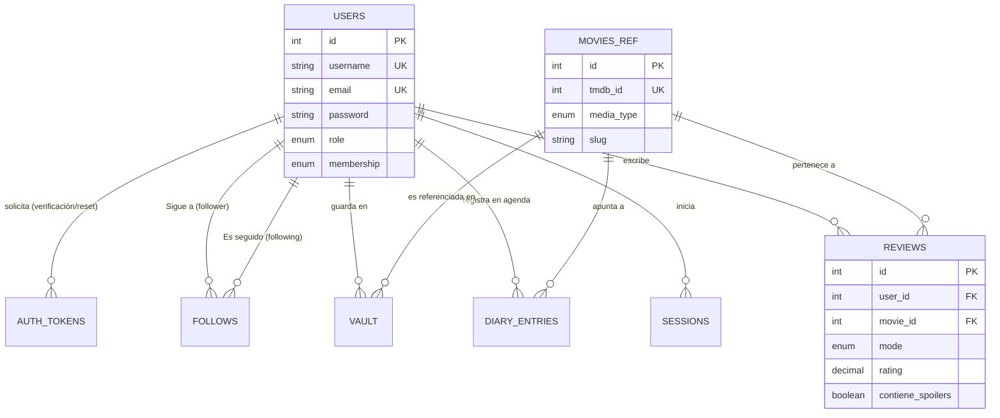

# Arquitectura y Evolución de la Base de Datos - CineVault

Este documento detalla el diseño de la base de datos relacional del backend de CineVault, los fundamentos técnicos detrás de las decisiones de infraestructura (como el uso de MariaDB y Prisma), cómo ha evolucionado el modelo de dominios junto con las iteraciones del proyecto y un profundo análisis de las tablas centrales (Core) de la plataforma.

---

## 1. Fundamentos Técnicos: ¿Por qué MariaDB (MySQL)?

La elección del motor de base de datos (`provider = "mysql"` en Prisma, en la práctica orientado hacia derivados de alto rendimiento como MariaDB) obedece a las naturaleza profundamente relacional del proyecto:

1.  **Naturaleza Relacional de CineVault:** La red social del sistema se construye con relaciones fuertes: Usuarios interactúan con Review, Películas, Listas, Vaults y se siguen entre sí. Las bases de datos relacionales garantizan la **Integridad Referencial ACIDs**; evitar que reseñas apunten a películas que no existen o registros huérfanos si un usuario borra su cuenta.
2.  **Por qué NO NoSQL (ej. MongoDB):** En entornos NoSQL tendríamos que optar por la desnormalización masiva. Si un usuario cambia cambiar su nombre o avatar, habría que actualizar todas las colecciones de reseñas, comentarios, "follows", listas, etc. Para un equipo reducido, esto introduce una complejidad y un eventual problema de inconsistencia paralela enorme (Eventual Consistency problem).
3.  **MariaDB:** Ofrece excelentes motores de lectura rápida (InnoDB optimizado), un consumo de recursos en servidor más predecible que alternativas puristas como PostgreSQL, y maneja de manera muy eficaz un gran flujo de *JOINs* que CineVault necesita masivamente.
4.  **Prisma ORM:** Seleccionado para servir como puente "Type-Safe" que permite generar diagramas, estructurar migraciones ordenadas, autocompletados en TypeScript, y evitar inyecciones SQL nativas.

### Lo que se dejó atrás por limitaciones de complejidad:
*   **Bases de Datos Locales para Películas:** Para no tener una base inmensa que gestionar y sincronizar, se dejó la "Fuente de Verdad" de películas/series en el **TMDb**, usando nuestra base de datos sólo como **punto de referencia** a través tablas referenciales (`movies_ref`, `persons_ref`) que enlazan con TMDb (`tmdb_id`). Esto redujo abismalmente la complejidad de actualizar metadata (posters, sipnosis) constantemente de forma local.
*   **Microservicios y Sharding de bases de datos:** Implementar bases de datos fragmentadas y arquitecturas orientadas a eventos CQRS introducían capas de mantenimiento muy altas sin ser estrictamente necesarias durante esta etapa de tracción.
*   **Eliminación Controlada (Soft Deletes):** Manejar un flag global de `is_deleted = true` en todo lugar (Soft Delete) ensucia todas las consultas del backend y en un equipo reducido multiplica los fallos en seguridad de visualización. Por ello se optó por un uso agresivo del `ON DELETE CASCADE`.

---

## 2. Evolución del Modelo (Cronología Repositorio)

La base de datos fue moldeándose progresivamente según la necesidad del proyecto:

*   **Fase 1: Identidad y Seguridad Inicial (Febrero 2026):**
    *   Setup de Prisma.
    *   Nacimiento de tabla `users`.
    *   Configuración fuerte de seguridad, implementando sesión híbrida (`refresh_token`) a través de la tabla relacional `sessions`.
    *   Validaciones extra mediante la tabla temporal de `auth_tokens` (verificación de correo electrónico y RBAC: roles/membresías).
*   **Fase 2: Social y Retención (Marzo 2026):**
    *   Adición de sistemas sociables: `follows`, y `notifications`.
    *   Las notificaciones empezaron a relacionar receptores y emisores vinculadas con los eventos en tiempo real usando Socket.io.
    *   Implementaciones orgánicas de pago: `subscriptions` y `payments` de forma pasiva, vinculadas globalmente al status de un User.
*   **Fase 3: Dominio Central Cinéfilo y Gamificación (Marzo 2026):**
    *   Nacimiento de las tablas que diferencian CineVault: `arcos`, `vault_social_entries`, `cinematographic_signature`, `curated_gallery_items`, y un potente `reviews` enriquecido con Modos de Valoración (Rápido, Estándar, Crítico).
    *   Manejo de feeds. Tablas para eventos de compartidos y elementos guardados (`user_feed_bookmarks`).
*   **Fase 4: Modelo Multi-Media Omnipresente (Abril 2026):**
    *   Adaptación de las referencias core (`movies_ref`, `diary`, `reviews`) para soportar `media_type` a modo ENUM (`movie`, `tv`). Refactor grande para dejar de lado un sistema solamente atado a largometrajes, a soportar la televisión sin tener que separar o duplicar tablas enteras.

---

## 3. Topología Entity-Relationship (Core)

---

## 4. Análisis de Tablas Core en Profundidad

### Entidad: `users`
Es la tabla más aglomerada, raíz de la integridad referencial.
*   **Misión:** Almacenar perfil de identidad, autenticación base, banderas de comportamiento (failed attempts, locked_until) para bloquear bruteforcing local.
*   **Restricciones:** Índices Únicos (`@unique`) estrictos para `email`, `username`, además de mapear identificadores sociales como el `google_id`.
*   **Índices Secundarios:** Posee índices directos en `role`, `membership`, `locked_until`, `is_verified` junto con su `created_at` permitiendo al panel de administración ordenar o hacer reportes rápidos a listas tabulares en tiempo O(log N).

### Entidad: `sessions`
La solución adoptada frente al almacenamiento frágil en el localstorage del JWT (Acceso).
*   **Misión:** Administra persistencia, expiración y la procedencia (`user_agent`, `ip_address`) para control de sesiones activas (y eventual capacidad para "cerrar sesión en otros dispositivos").
*   **Diseño:** Contiene un identificador principal de cadena UUID (`db.VarChar(36)`). Guardo el hash de `refresh_token`. El vínculo con el usuario posee `ON DELETE CASCADE`. Un borrado del perfil del usuario destruye sin fallos sus credenciales de sesiones activas.
*   **Índices:** Indexación dedicada al `refresh_token` permitiendo a la ruta que procesa el refresco hacer `SELECT` con una complejidad muy baja, y también por `user_id`.

### Entidad: `auth_tokens`
Utilizada casi exclusivamente para los flujos asíncronos cortos.
*   **Misión:** Almacenar UUIDs en correos (ej: restablecer contraseñas, activación de cuentas).
*   **Optimización:** Usar esta tabla secundaria previene inyectar columnas muertas (llenas de `NULL`) como `password_reset_token` en la tabla maestra de `users`.

### Entidad: `follows`
Motor del engranaje social. Es una tabla asociativa autogestionada (Self-Referencing Many-to-Many sobre la tabla `users`).
*   **Misión:** Administrar el gráfico direccional de red social.
*   **Complejidad y Despliegue:**
    *   No tiene *Soft Delete*. Si alguien deja de seguir a otra persona, el row es eliminado de la base de datos físicamente mediante Prisma.
    *   Posee una re-restricción combinada `@@unique([follower_id, following_id], map: "follower_id")`. A nivel motor evita absolutamente que un usuario siga a la misma persona 2 veces por error transaccional de peticiones concurrentes del frontend (Race Conditions).
    *   Si un usuario se va o es expulsado, la purga mediante las llaves `Cascade` se encarga de limpiar ambas listas de seguidores/seguidos.

### Los Patrones de Índices Extendidos e Integridad
Para potenciar la fluidez del "Feed Social", gran parte de las tablas de contenido (`vault`, `reviews`, `user_feed_bookmarks`) contienen un índice compuesto a nivel motor:
`@@index([user_id, created_at])` o `@@index([user_id, added_at])`.

> [!TIP]
> **Beneficio en Rendimiento:** Un índice combinado de *entidad + fecha* permite al planificador de consultas de MariaDB resolver una paginación que dice "Dame los últimos 20 favoritos de X usuario ordenados del más reciente al más antuguo" usando **solo el índice de forma lineal**, procesando en escasos milisegundos saltándose la fase manual de clasificación.
