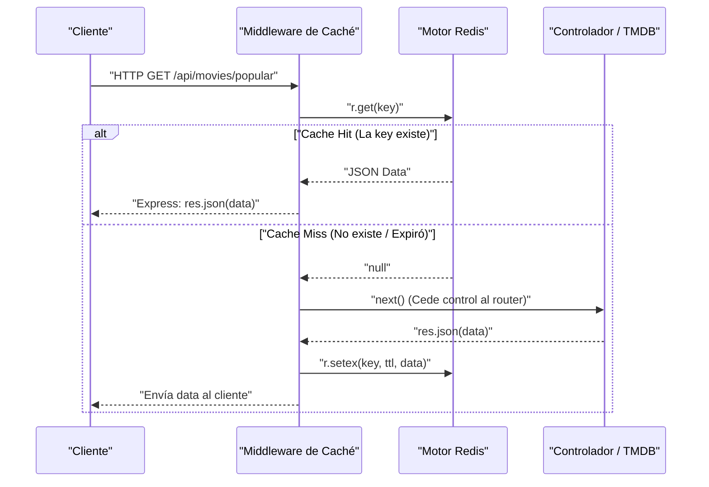
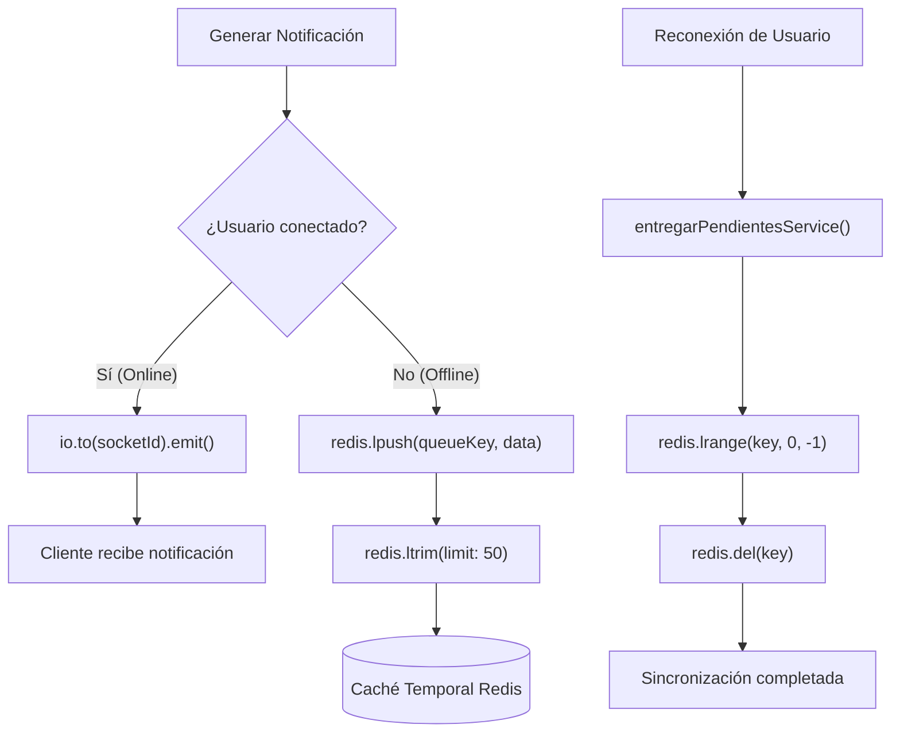

# Arquitectura e Implementación de Redis en CineVault

**Estado**: Finalizado  
**Objetivo**: Analizar y centralizar la documentación técnica sobre la arquitectura de Redis usada en CineVault, detallando su uso como motor de caché rápido, gestor de colas de eventos (notificaciones) y su despliegue dentro del ecosistema Docker.

---

## 1. Visión General: ¿Qué es Redis y por qué lo utilizamos?

**Redis** (Remote Dictionary Server) es un almacén de estructuras de datos en memoria sumamente rápido, utilizado habitualmente como base de datos, caché y bróker de mensajes. Dado que guarda los datos directamente en la memoria RAM, proporciona latencias de menos de un milisegundo.

En el contexto de **CineVault**, las peticiones a la API externa de TMDB (The Movie Database) son un cuello de botella por la latencia de red inherente (hasta cientos de milisegundos). Al aplicar una capa de **caché** con Redis, reducimos drásticamente los tiempos de carga en el cliente. Adicionalmente, CineVault también utiliza el motor de Redis como sistema ligero para gestionar **colas de desconexión** en el sistema de notificaciones en tiempo real, lo que le aporta versatilidad al diseño arquitectónico.

---

## 2. Estrategia de Caché: Optimizando Peticiones a TMDB

Para atajar las limitaciones y la latencia propia de consumir APIs de terceros (TMDB), implementamos el middleware `cache.middlewares.ts`. Esta implementación utiliza un patrón *Proxy/Wrapper* para interceptar las respuestas que salen de Express y persistirlas en Redis con un determinado **Tiempo de Vida (TTL)**.

### 2.1 Componentes Principales
1. **`lib/redis.ts`**: Cliente central y Mock de entorno en memoria (`RedisLike`) permitiendo aislar el entorno de *testing*.
2. **`lib/cache.ts`**: Utilidad que estandariza la serialización de datos a JSON y agrega seguridad de tipos a las transacciones de caché (`setCache`/`getCache`/`invalidateKeys`).
3. **`middlewares/cache.middlewares.ts`**: Middleware de Express que captura la clave y recupera o salva la respuesta HTTP (`res.json`).

### 2.2 Diagrama de Flujo del Caché Middleware



### 2.3 Ejemplo de Implementación (Caching)

En CineVault evitamos ensuciar la lógica principal de los controladores con operaciones de caché, y delegamos la gestión en el interceptor `cachear`:

```typescript
// middlewares/cache.middlewares.ts
export const cachear = (ttl: number, keyFn: (req: SolicitudAutenticada) => string) => {
  return async (req: SolicitudAutenticada, res: Response, next: NextFunction) => {
    const key = keyFn(req);
    const cached = await redis.get(key);

    if (cached) return res.json(JSON.parse(cached)); // CACHE HIT

    // CACHE MISS: Envolvemos res.json para guardar en Redis exitosamente (Proxy)
    const jsonOriginal = res.json.bind(res);
    res.json = (body) => {
      if (res.statusCode >= 200 && res.statusCode < 300) {
        redis.setex(key, ttl, JSON.stringify(body)).catch(console.error);
      }
      return jsonOriginal(body); // Continuar el flujo estándar de Express
    };
    next();
  };
};
```

---

## 3. Gestor de Colas y Notificaciones (Eventos Temporales)

CineVault utiliza Socket.IO para el envío de notificaciones en tiempo real, pero es muy probable que los usuarios reciban eventos mientras están desconectados. Para eso, usamos Redis asincrónicamente mediante operaciones con **Listas** (`lpush`, `lrange`, `ltrim`) funcionando en este caso como un gestor de colas en vez de la característica tradicional de *Pub/Sub*.

### 3.1 Flujo de Entrega Asíncrona (Offline Delivery)

Cuando surge una notificación, el sistema evalúa si el *socket* del usuario está activo. Si no es así, envía la notificación a una "cola" persistente en memoria por usuario (`notif:queue:{id}`).



### 3.2 Ejemplo de Implementación (Colas de Eventos)

El servicio correspondiente, localizado en `services/notifications.services.ts`:

```typescript
// services/notifications.services.ts

const queueKey = (userId: number) => `notif:queue:${userId}`;

export const emitirNotificacionService = async ({ user_id, sender_id, type }) => {
  const notificacion = await notificationsRepository.create({ user_id, sender_id, type });
  const socketId = usuariosConectados.get(user_id);
  
  if (socketId) {
    // Usuario online: Entrega limpia
    io.to(socketId).emit("nueva_notificacion", notificacion);
  } else {
    // Usuario offline: Usar las Listas de Redis como Cola Simple (Máx: 50 notificaciones)
    await redis.lpush(queueKey(user_id), JSON.stringify(notificacion));
    await redis.ltrim(queueKey(user_id), 0, 49); // Mantiene una memoria eficiente
  }
  return notificacion;
};

// Se invoca cuando el usuario se autentica o inicializa el cliente
export const entregarPendientesService = async (userId: number) => {
  const key = queueKey(userId);
  const pendientes = await redis.lrange(key, 0, -1);
  if (pendientes.length === 0) return [];

  // Liberamos la memoria una vez consumidas
  await redis.del(key);
  return pendientes.map(raw => JSON.parse(raw));
};
```

---

## 4. Infraestructura y Despliegue con Docker

A nivel de infraestructura (DevOps), Redis requiere garantizar durabilidad, uso eficiente de CPU/RAM y un checkeo de disponibilidad continuo. La solución nativa es levantar el contenedor en `docker-compose.yml`.

### 4.1 Archivo de configuración Docker (docker-compose)

```yaml
services:
  redis:
    image: redis:7-alpine
    container_name: cinevault-redis
    ports:
      - "6379:6379"
    volumes:
      - redis_data:/data
    # AOF (Append Only File) asegura que los datos no se pierdan 
    # ante una caída repentina de Redis.
    command: redis-server --appendonly yes --requirepass ${REDIS_PASSWORD}
    restart: unless-stopped
    deploy:
      resources:
        limits:
          memory: 256M # Operar eficientemente evitando que agote RAM del propio host
    healthcheck:
      test: ["CMD", "redis-cli", "-a", "${REDIS_PASSWORD}", "ping"]
      interval: 10s
      timeout: 5s
      retries: 3
```

### 4.2 Conceptos de Despliegue Destacados
- **Durabilidad (AOF)**: Al usar `--appendonly yes`, Redis lleva un diario en tiempo real de escritura. Esto permite que en el próximo reinicio restaure su conjunto de datos, evitando desincronización de notificaciones o cachés críticos (comparado con snapshots RDB).
- **Control de Memoria**: La directiva de 256MB en `limits` evita desbordamientos en servidores pequeños (VPS), ideal para arquitecturas limitadas.
- **Imagen `alpine`**: Mantiene la imagen mínima (~15 MB), priorizando la seguridad y portabilidad, siendo inmejorable comparado con imágenes pesadas con binarios innecesarios.
- **Portabilidad en Testing (Mocking)**: Para evitar levantar el contenedor constantemente en sistemas de IC (o en TDD local), `src/lib/redis.ts` implementa todo un motor transitorio *InMemory* (Mock) cuando el entorno detona un `NODE_ENV === "test"`. Las operaciones de listas simuladas (`ltrim`, `lpush`), llaves efímeras (TTL) validan de idéntica manera a la instancia Docker sin su pesada integración.

---
**Consideración Final para Rendimiento:** El patrón middleware garantiza un bypass que protege la Base de datos relacional (PostgreSQL) y la de terceros (TMDB) durante una congestión de peticiones altas. En combinación con la purga periódica, aporta durabilidad y respuesta elástica a la plataforma de CineVault.
