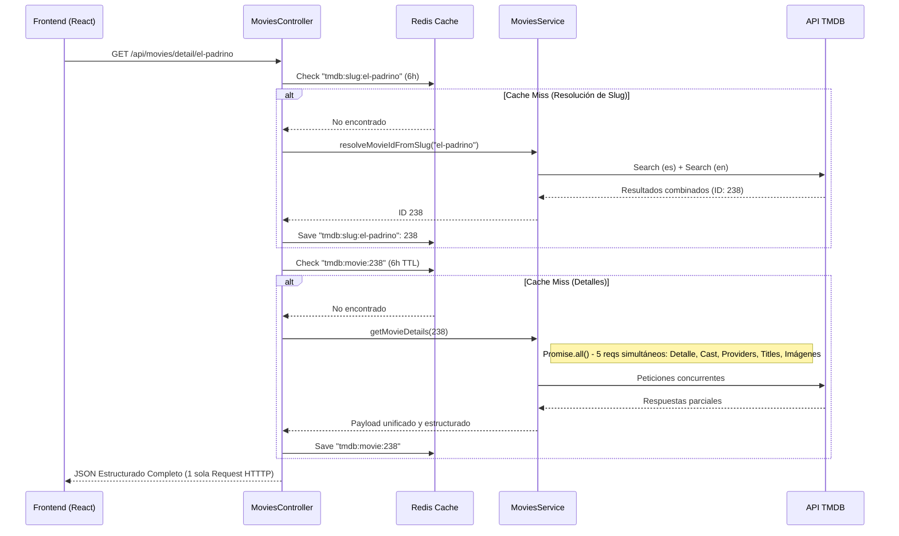

# Arquitectura e Integración de la API de TMDB en CineVault

Este documento detalla exhaustivamente cómo el backend de CineVault interactúa con *The Movie Database* (TMDB). Abarca desde la configuración de bajo nivel y el manejo de los límites de consumo (Free Tier), hasta la orquestación avanzada de rutas, caché en Redis y la vinculación con nuestra base de datos.

---

## 1. Consumo de Servicios Externos: Funcionamiento de TMDB y Estrategia

CineVault utiliza la API v3 de TMDB como única fuente de verdad (Single Source of Truth) para todos los metadatos cinematográficos. Esta decisión estratégica nos permite centrar nuestros esfuerzos en la experiencia social y de usuario (listas, diarios, reseñas) sin requerir el mantenimiento de una gigantesca base de datos multimedia.

### 1.1 `fetchTMDB.ts`: El Bridge de Integración
Toda la comunicación externa está aislada y tipada a través del helper `consultarTMDB` en `src/helpers/fetchTMDB.ts`. Esto nos brinda control absoluto sobre:

- **Autenticación:** Inyección automática del *Bearer Auth* (`process.env.API_KEY_TMDB`).
- **Normalización Idiomática:** Por defecto, todas las peticiones solicitan datos en `es-ES`. Si no existen adaptaciones al español, se hace *fallback* al inglés original en el Front. Se permite desactivar la inyección para requests especiales (ej: peticiones en `en-US` para el motor de slugs).
- **Limpieza de Parámetros:** Elimina propiedades vacías para mantener URLs limpias y mejorar el ratio de "acierto" de la caché.
- **Gestión Unificada de Errores:** Convierte los fallos HTTP (ej. 401 Unauthorized o 404 Not Found por parte de TMDB) en Excepciones controladas en nuestra instancia local, evitando caídas silenciosas.

### 1.2 Free Tier, Limites y Dobles Peticiones
La API de TMDB en su *Free Tier* no impone un límite mensual estricto, pero sí un **Rate Limit de aproximadamente 40-50 request por segundo por IP/Key**.

**¿Cómo gestionamos y respetamos esto?**
- **Caché Ofensiva:** Virtualmente todas las lecturas de TMDB se envuelven en Redis.
- **Evitamos "Dobles Peticiones" desde Frontend ("Batching"):** Si el frontend solicitara los detalles de la peli, sus actores, sus plataformas de *streaming*, y sus trailers tendría que hacer 4 a 5 peticiones y el consumo de red explotaría. Resuelto desde Backend a través del uso concurrente de promesas (`Promise.all()`), retornamos un único payload masivo.

---

## 2. Estructura de Datos, Rutas y Orquestación Backend

El flujo está diseñado prestando especial atención al *SEO*, unificando la navegación mediante **Slugs** (ej. `el-padrino`) en lugar de depender exclusivamente de IDs numéricos que penalizan los ecosistemas webs. 

### 2.1 Gestión y Resolución de `slugId`
La resolución convierte una URL amigable a un `movieId` válido de TMDB. Para lograr precisión, el servicio `resolveMovieIdFromSlug`:
1. Convierte el *slug* en una cadena válida de búsqueda.
2. Lanza **2 búsquedas en paralelo** a TMDB: una en español (es-ES) y otra en inglés (en-US) para no perder resultados indizados nativamente.
3. Se integran ambas fuentes pasando los arrays por `mergeEnglishAndSpanishResults`.
4. Los resultados entran en un evaluador propio de similitud léxica (`rankMovieByQuery`) que organiza por afinidad estricta y detecta el título ideal.
5. El sistema extrae de ahí el ID exacto y lo utiliza para obtener la cascada de recursos.

### 2.2 Endpoint de Detalle: Prevención del Network Waterfall
Cuando el controlador llama a `MoviesController.getDetail`, se invoca nuestro servicio estrella y agregador: `getMovieDetails(movieId)`:

---

## 3. Relación con la Capa de Datos (PostgreSQL)

Nuestra base de datos no guarda *toda* la información de TMDB. Utilizamos el modelo de **Referencias Foráneas Virtuales (MovieRef)**:

1. El usuario interactúa y guarda una película en sus Favoritos o Códice.
2. Se registra un apunte en `MovieRef` (donde la Clave Primaria referencial es esencialmente el respectivo `tmdb_id` provisto por TMDB, así como metadatos super básicos si es necesario).
3. Tablas relacionales (como *Diaries*, *Favorities*, o *Reviews*) se relacionan hacia nuestra ID local de `MovieRef`. 
4. A los ojos de la app, toda la entidad base es reconstruida *en tiempo de vuelo* (on the fly) al hidratar la vista en el Frontend invocando nuestro servicio unificado que ya está servido ágilmente desde **Redis**.

A nivel de **Redis**, apoyamos estas relaciones controlando estrictamente los Tiempos de Vida (TTL):
- `TTL_LISTAS` (Populares, Búsqueda): **1 hora** (Cambian constantemente).
- `TTL_DETALLE`: **6 horas** (Los metadatos/actores de una película rara vez mutan de un momento al otro).

---

## 4. Análisis de Dependencias (Pros y Contras)

La dependencia extrema de un servicio de terceros como TMDB (BaaS: *Backend as a Service* for metadata) es un clásico escenario de mitigación de riesgo. A continuación las claves analizadas para el contexto de CineVault:

### Ventajas Competitivas Evidentes
- **Mantenimiento Cero en Origen:** La comunidad actualiza la metadata a nivel mundial (actores, sinopsis, backdrops HQ, providers de servicios streaming VOD como Netflix). Esto es una funcionalidad imposible de replicar por un único desarrollador.
- **Agilidad del Costo de Infraestructura:** No es necesario alojar Terabytes de portadas y *Backdrops* localmente en buckets S3 ni en Base de Datos; consumimos directamente los CDNs distribuidos provistos por la API de TMDB (`image.tmdb.org`).
- **Data Engineering Pre-existente:** Aprovechamos los complejos motores de "Recomendación" y "Trending" desarrollados por ingenieros en TMDB listos para consumirse vía endpoints como `/movie/upcoming`.

### Limitaciones de Depender de Terceros
1. **Lógica de Referencia "Huérfana":** Si The Movie Database decide borrar permanentemente el ID (p.e: una serie cancelada que fue removida o fusionada), nuestros usuarios podrían acceder a Favoritos con `tmdb_id = 120938`, pero al intentar hidratar contra TMDB dará 404. Nuestro backend debe atrapar este `404` graciosamente y mostrar un estado de error manejado en Front (*Missing Media*).
2. **Latencias Intrínsecas y Puntos de Falla (SPOF):** Si su servicio de API entra en "Mantenimiento" o "Caída Parcial", la parte de descubrimiento y visualización de perfiles en CineVault cae inmediatamente con ellos. Esto se amortigua pero no se elimina 100% con la robustez de *Redis*.
3. **Limitación Específica del Búscador:** Al no tener las películas guardadas localmente, no es posible lograr consultas que mezclen nuestras propias tablas con la búsqueda total de TMDB mediante SQL tradicional (p. ej: "Trae de la BD todas las películas de horror que el Usuario X aún no ha visto"). Requerimos hacer comprobaciones de colecciones in-memory a nivel código tras traer el listado genérico de TMDB.

---
*Este análisis documenta los estándares de integración y proporciona visibilidad estructural para el mantenimiento futuro y revisiones arquitectónicas por el equipo técnico y académico.*
